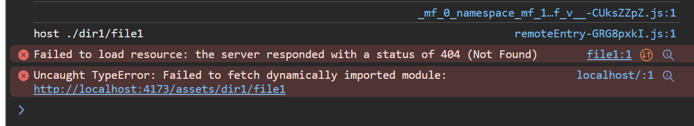
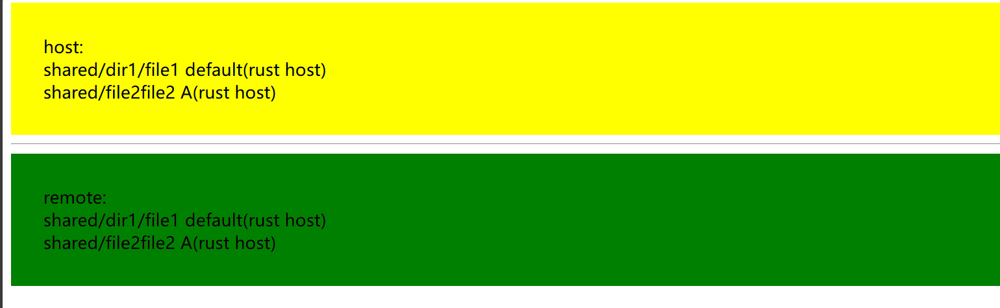

# React host and remote

## Reproduction

1. `pnpm --filter=shared-directory-* build`
2. `pnpm --filter=shared-directory-* preview`

## Results

- rust host: http://localhost:5172

- vite host: http://localhost:4173

